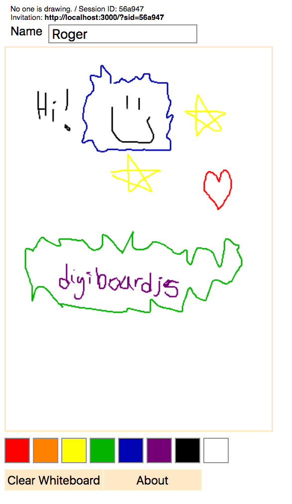

# digiboardjs
Whiteboard Demo using Web Sockets

Roger Ngo
http://rogerngo.com
rogerngo90@gmail.com
2018

----

## Introduction

This is a demonstration of WebSockets using Node package of socket.io. 

The application is a basic whiteboard where users can create new white board sessions, or join in on existing ones to collaborate together.

The libraries make use of Express JS for the backend and React components for the front end.

## Installation Instructions
```
npm install
npm build
npm start
```

### Demo Link
http://digiboardjs.azurewebsites.net

### Screenshots
